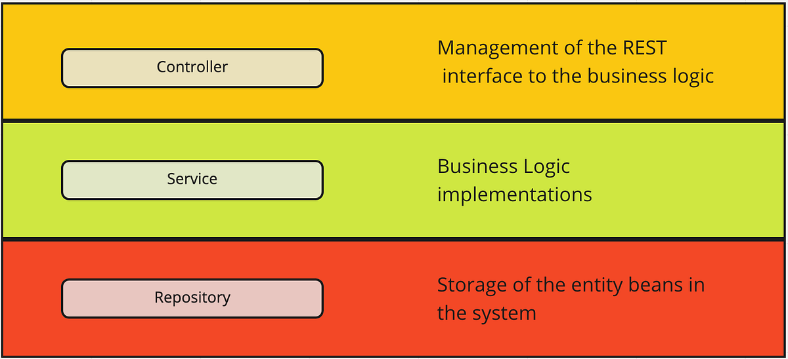

# Documentação Backend - NutreAI

## 1 - Visão geral
Este backend é responsável por fornecer uma ***API RESTful*** para a interface gráfica de uma aplicação web de **criação e gerenciamento de dietas** geradas por IA. 
Para o desenvolvimento, foi usado **Node.JS**, **TypeScript** e **NestJS** e **PostgreSQL** como banco de dados.

## 2 - Arquitetura e Módulos
Este backend segue o padrão arquitetural ***Controller-Service-Repository*** (CSR), uma arquitetura em camadas amplamente utilizada em projetos comerciais e acadêmicos.



A aplicação é composta por 4 módulos: **AI**, **Auth**, **Users** e **WeeklyDiet**. Cada módulo é responsável por uma das principais funcionalidades da aplicação: 
- **AI**: Comunicação com a IA e tratamento das respostas.
- **Auth**: Autenticação dos usuários.
- **Users**: Gerenciamento dos usuários e suas informações.
- **WeeklyDiet**: Gerenciamento das dietas dos usuários.


## 3 - Tecnologias e Dependências
Este backend foi desenvolvido em **TypeScript**, utilizando **NestJS** como framework e **Node.js** como ambiente de execução. Além dessas tecnologias principais, outras ferramentas foram utilizadas para suportar funcionalidades específicas:

- **TypeORM**: (Object Relational Mapper) Utilizado para comunicação com o banco de dados PostgreSQL.
- **bcryptjs**: Biblioteca de codificação e decodificação de strings. Usada na codificação de senhas do usuário.
- **JWT**: Tecnologia de gerenciamento de sessões do usuário, baseada em tokens validados para autenticação.
- **Jest**: Framework de testes usado para garantir a qualidade do código, realizando testes unitários.

Os arquivos ***package.json*** e ***package-lock.json*** contém as dependências da API. Para instalar todas as dependências na versão correta, é necessário executar o comando abaixo na raiz do backend.
```bash
npm install
```

