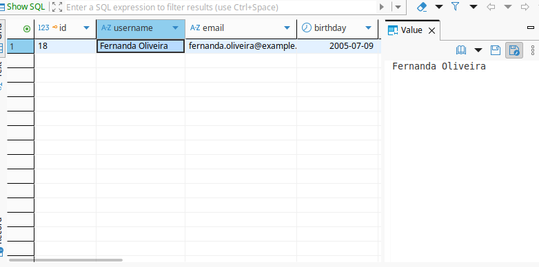
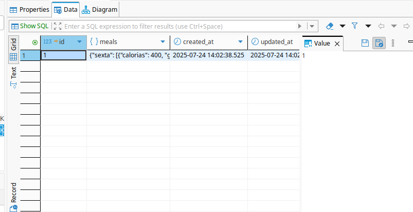

# Documentação Backend - NutreAI

## 1 - Visão geral
Este backend é responsável por fornecer uma ***API RESTful*** para a interface gráfica de uma aplicação web de **criação e gerenciamento de dietas** geradas por IA. 
Para o desenvolvimento, foi usado **Node.JS**, **TypeScript**, **NestJS** e **PostgreSQL** como banco de dados.

## 2 - Arquitetura e Módulos
Este backend segue o padrão arquitetural ***Controller-Service-Repository*** (CSR), uma arquitetura em camadas amplamente utilizada em projetos comerciais e acadêmicos.

- **Controller**: Camada de interface com o consumidor da API. Nela é aplicada *pipes* iniciais, como **DTOs** e **Guards**. Suas funções são dividas por requisições **HTTP** e **rotas**. Para atender essas requisições, é necessário acessar a camada inferior.

- **Service**: Camada que implementa a lógica de negócio e realiza tratamento de erros, como email inválido em requisições login.

- **Repository**: Camada de acesso ao banco de dados. Nenhuma lógica de negócio é aplicada nesta camada, apenas tratamento mínimo de erros e comunicação com o banco de dados através do **TypeORM**.


A aplicação é composta por 4 módulos: **AI**, **Auth**, **Users** e **WeeklyDiet**. Cada módulo é responsável por uma das principais funcionalidades da aplicação: 
- **AI**: Comunicação com a IA e tratamento das respostas.
- **Auth**: Autenticação dos usuários.
- **Users**: Gerenciamento dos usuários e suas informações.
- **WeeklyDiet**: Gerenciamento das dietas dos usuários.


## 3 - Tecnologias e Dependências
Este backend foi desenvolvido em **TypeScript**, utilizando **NestJS** como framework e **Node.js** como ambiente de execução. Além dessas tecnologias principais, outras ferramentas foram utilizadas para suportar funcionalidades específicas:

- **TypeORM**: (Object Relational Mapper) Utilizado para comunicação com o banco de dados PostgreSQL.
- **bcryptjs**: Biblioteca de codificação e decodificação de strings. Usada na codificação de senhas do usuário.
- **JWT**: Tecnologia de gerenciamento de sessões do usuário, baseada em tokens validados para autenticação.
- **Jest**: Framework de testes usado para garantir a qualidade do código, realizando testes unitários.

Os arquivos ***package.json*** e ***package-lock.json*** contém as dependências da API. Para instalar todas as dependências na versão correta, é necessário executar o comando abaixo na raiz do backend.
```bash
npm install
```

## 4 - AI
O módulo **AI** deste backend é responsável pela comunicação e tratamento das respostas do *LLM* usado para geração dos planos alimentares. Neste backend, o agente escolhido foi o **Groq Compound-Beta**, que recebe informações essenciais do usuário para gerar as dietas (idade, peso, restrições alimentares, etc) e retorna, idealmente, um *JSON* de um plano alimentar semanal com 3 refeições diárias e 1 lanche, separados para cada dia.

## 5 - Autenticação
A autenticação deste backend é baseada em **JSON Web Token (JWT)** com o auxílio de **Guards** para proteger rotas e garantir que apenas usuários autenticados possam acessar determinados recursos.

O processo de autenticação ocorre quando um usuário envia suas credenciais (email e senha) para o backend (realiza login). O backend valida essas credenciais e, se forem corretas, gera um **token JWT**. Este token será usado para autenticar o usuário nas requisições subsequentes.

- **Envio das credenciais**: O cliente envia uma requisição POST para o endpoint de login com as credenciais do usuário.

- **Validação no backend**: O backend verifica se as credenciais correspondem a um usuário válido no banco de dados.

- **Geração do JWT**: Se as credenciais estiverem corretas, o backend gera um JWT e o retorna para o cliente.

- **Envio do JWT**: O cliente armazena o JWT e o envia nas requisições subsequentes usando o cabeçalho *Authorization* e o modificador *Bearer*. 

Em rotas protegidas, o **Guard** é responsável por verificar a validade do token enviado, retornando **true** caso todas as informações estão válidas e lançando uma exceção **Unauthorized** caso contrário.

## 6 - Users
O módulo **Users** desta API é responsável pelo gerenciamento e criação dos usuários e suas informações. Esse módulo segue o padrão arquitetural definido, isto é, o *Controller* é a camada de recebimento das requisições, o *Service* aplica a lógica de negócio, e o *Repository* acessa o banco de dados.

Além disso, o módulo Users contém o ***User.entity***, definindo os atributos que cada usuário terá no banco de dados.

## 7 - Weekly-diet
O módulo **Weekly-diet** deste backend é responsável pela criação e visualização dos planos alimentares gerados pela IA. Esse módulo também segue a arquitetura em camadas proposta. 
O endpoint de criar dieta tem uma direta relação com o módulo **AI**, visto que para a requisição da dieta ser atendida, é necessário a resposta do *LLM*.
Assim como o módulo *Users*, **Weekly-diet** possui um ***weekly-diet.entity***, estrutura que desempenha a função de definir os atributos dos planos alimentares no banco de dados


## 8 - Testes
Este backend possui um amplo conjunto de testes unitários de grande cobertura. Para isso, foi usado o *framework* **Jest**, também usado na criação de valores *mockados*. Na execução dos testes, foi usado o comando
```bash
npm test
```
Uma boa cobertura de testes foi alcançada, cerca de (adicionar valor depois)% das funções mapeadas e validadas.

[imagem_aqui]()

## 9 - Banco de dados
Foi usado um banco de dados **PostgreSQL** para armazenamento das informações dos usuários.

Neste banco de dados existem 2 tabelas, para Users e Weekly-diet, as duas *entities* que compõem o funcionamento da API. **Users** e **Weekly-diet** estão relacionadas entre si por uma chave estrangeira **UserId**, que liga uma dieta a um usuário único.

tabela dos usuários visualizada na aplicação *Dbeaver*

tabela das dietas visualizada na aplicação *Dbeaver*


Como dito anteriormente, para conectar o código do backend ao banco de dados foram usados os métodos da biblioteca **TypeORM**.


